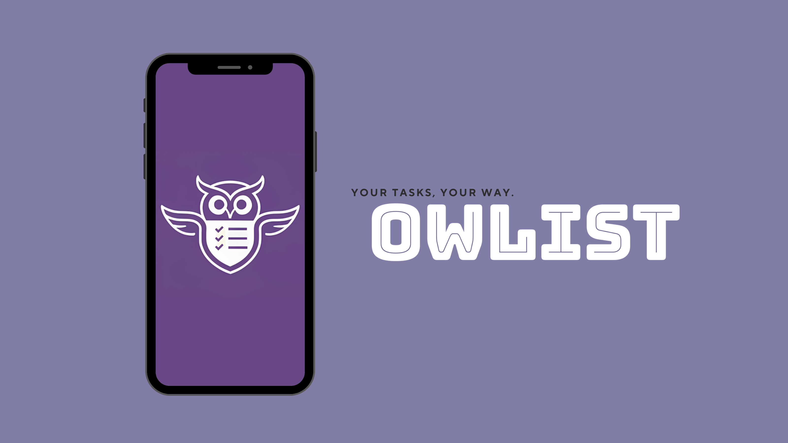

## Table of Contents
- Introduction
- Features
- 🎥 Video
- Upcoming Release on Google Play
- Contributing
- Feedback

## Introduction
Owlist is a user-friendly app designed to assist you in setting and achieving your goals. With its intuitive interface, it allows you to create lists of goals or tasks effortlessly.
With Owlist, effortlessly organize your aspirations, set deadlines, and track your progress, making goal management a seamless part of your daily routine.

## Features
- **Goal Lists:** Create lists of goals or tasks with deadlines or without.
-  **Checklist Items:** Add items to your lists with descriptions and clickable links.
    - **Item Sorting:** Sort items in your list as you wish. Checked items automatically move to the bottom for easy organization.
    -  **Item Content:** Add detailed descriptions, notes, or instructions to each checklist item.
    -  **Clickable Links:** Include URLs within item descriptions that become clickable for easy access.
- **Progress Tracking:** Visualize your progress for each list.
- **Statistics:** View detailed statistics and data about your progress.
- **Notifications:** Receive reminders a day before deadlines to stay on track.
- **Customization:** Choose app themes and notification times.
- **Language Support:** Supports both Hebrew and English languages.

## Video

## Upcoming Release on Google Play
I'm thrilled to share that Owlist is currently in the final stages of closed testing. Soon, the app will be available on Google Play for a broader audience. If you're eager to get early access and contribute to the testing phase, feel free to send me a message, and I'll add you to the testing group. Your feedback will be invaluable as we prepare to launch Owlist to the wider community. Stay tuned for updates and be part of shaping the future of goal-tracking with Owlist!

## Contributing
Your contributions are welcome! Fork the repository, make improvements, and submit a pull request.

## Feedback
Have ideas, suggestions, or issues? Feel free to open an issue on GitHub or contact us directly.
**Star**  this repository and tell all your friends about it.

Thanks for your interest in this project ❤️
